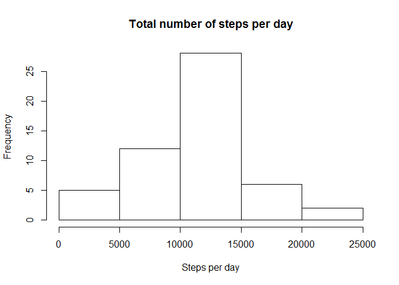
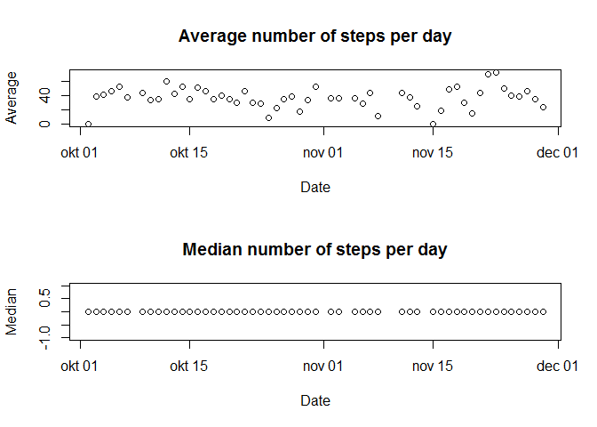
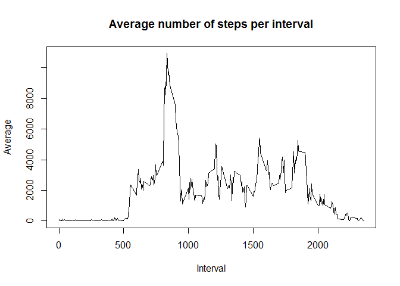
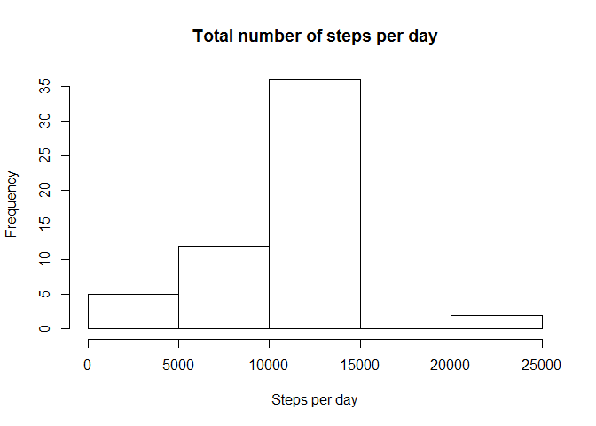
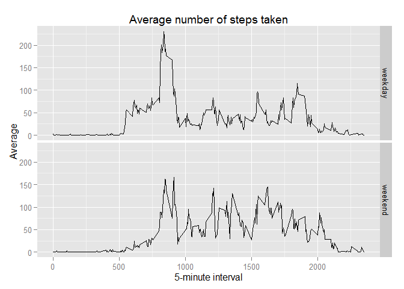

# Reproducible Research: Peer Assessment 1


## Setting the stage
To set up the local environment for processing, a number of things are carried out before the real work starts:
        
- the working directory is set  
- warnings are turned off for the duration of this session    
- necessary R packages are loaded       
- the R Markdown code chunk settings are set for the duration of this session   

The following code is used for this:

```r
setwd("E:/Cloudstation/R/reproducibleresearch/RepData_PeerAssessment1")
options(warn=-1)
library(knitr)
library(dplyr)
```

```
## 
## Attaching package: 'dplyr'
## 
## The following object is masked from 'package:stats':
## 
##     filter
## 
## The following objects are masked from 'package:base':
## 
##     intersect, setdiff, setequal, union
```

```r
library(ggplot2)
opts_chunk$set(echo = TRUE, results="hide")
```

## Loading and preprocessing the data
The data we are working with ("activity.zip") has already been downloaded and is part of the Github repository where you found this R Markdown file. It is unzipped and loaded into memory using:


```r
unzip("activity.zip")
activity <- read.csv("activity.csv")
```

Two of the three variables are integers and thus easy to work with. The last one, the dates of the observations, is a factor variable. Since it describes date-class information and factors are not easy to calculate with, this variable is transformed into a date class, using the following code:


```r
activity$date <- as.Date(as.character(activity$date))
```

## What is the mean total number of steps taken per day?
To calculate the total number of steps taken per day, the package dplyr comes in handy. Using this package, it is easy to take the data frame that was created in the previous step and group the observations by date. Subsequently, the missing values are removed for the duration of this calculation and the number of steps per observation are summed up per day. The result is then stored in a new data frame called "stepsperday". 


```r
stepsperday <- activity %>%
                        group_by(date) %>%
                        filter(steps != "NA") %>%
                        summarise_each(funs(sum, mean, median), steps)
```

This "stepsperday" has four columns, "date", "sum", "mean" and "median". The latter three all report a different property of the number of steps on a particular day. By plotting the sum in a histogram, we can see the frequency distribution of the total number of steps per day.


```r
hist(stepsperday$sum, 
                        main = "Total number of steps per day",
                        xlab = "Steps per day")
```

 

Calculating the mean and median of the total number of steps taken per day could mean two different things:
        
- the mean and median number of steps per day, across all 53 days       
- the mean and median number of steps, per day  

It didn't become clear from visiting the course forum which of the two meanings was intended. Therefore, both were calculated.


```r
meansteps <- mean(stepsperday$sum)
mediansteps <- median(stepsperday$sum)
meansteps
```

[1] 10766.19

```r
mediansteps
```

[1] 10765

The mean and median number of steps per day, across all 53 days, is 1.0766189\times 10^{4} and 10765, respectively. 

The mean and median on a daily basis can be investigated using the following plots. For the actual data, see the "mean" and "median" variables of the data frame "stepsperday".


```r
par(mfrow = c(2,1))
with(stepsperday, plot(date, mean, 
                        main="Average number of steps per day",
                        ylab="Average", 
                        xlab="Date"))

with(stepsperday, plot(date, median, 
                        main="Median number of steps per day",
                        ylab="Median", 
                        xlab="Date"))
```

 

## What is the average daily activity pattern?
The same calculations are carried out after averaging per interval instead of per day. 


```r
stepsperinterval <- activity %>%
                        group_by(interval) %>%
                        filter(steps != "NA") %>%
                        summarise_each(funs(sum, mean, median), steps)

with(stepsperinterval, plot(interval, sum, 
                        main="Average number of steps per interval",
                        ylab="Average", 
                        xlab="Interval", 
                        type="l"))
```

 

The interval with the highest number of steps can be found by sorting the data frame by step count and selecting the first interval in the list.


```r
highestinterval <- stepsperinterval %>%
                        arrange(desc(mean)) %>%
                        select(interval)

highestinterval[[1]][1]
```

[1] 835

## Imputing missing values
The index list of where the NA values can be found is useful and therefore calculated. The length of that list shows how many NA's there are in total. 


```r
missingindex <- which(is.na(activity$steps), arr.ind=TRUE)
length(missingindex)
```

[1] 2304

The NA's have been replaced by the average number of steps of the interval category in which it falls. This seems to be the best (simple) strategy, since the variance in steps per day is larger than the variance in steps per interval. 


```r
activityclean <- activity
for(i in 1:length(missingindex)) {
        temp <- activity[missingindex[i], 3]
        temp2 <- filter(stepsperinterval, interval == temp)
        activityclean[missingindex[i], 1] <- temp2[1, 3]
}
```

A new dataset, "stepsperdayclean", calculates the new means and medians. The histogram is immediately added without further comments. 


```r
stepsperdayclean <- activityclean %>%
                        group_by(date) %>%
                        summarise_each(funs(sum, mean, median), steps)
```


```r
hist(stepsperdayclean$sum, 
                        main = "Total number of steps per day",
                        xlab = "Steps per day")
```

 


```r
meanstepsclean <- mean(stepsperdayclean$sum)
medianstepsclean <- median(stepsperdayclean$sum)
meanstepsclean
```

[1] 10766.19

```r
medianstepsclean
```

[1] 10766.19

There is a small diference between the original and clean data, especially in the median number of steps per day.

## Are there differences in activity patterns between weekdays and weekends?

A new variable is added to the data frame with clean data (i.e. where the missing values were replaced by the respective interval averages). This new variable describes whether the date is a weekday or a weekend day. This is done with a combination of a for loop and an if-else statement. This method results in a variable with character class, which is then manually converted to factor class. 


```r
activityclean <- mutate(activityclean, daytype = weekdays(date))
for (i in 1:length(activityclean[,1])){
   activityclean[i, 4] <-
        if (activityclean[i, 4] == "zaterdag") {
                activityclean[i, 4] <- "weekend"
        } else if (activityclean[i, 4] == "zondag") {
                activityclean[i, 4] <- "weekend"
        } else {activityclean[i, 4] <- "weekday"
        }     
}
activityclean$daytype <- as.factor(activityclean$daytype)
```

For the comparison between weekday and weekend activity, the number of steps per interval have to be calculated again, however now using the cleaned up data and with the extra factor variable "daytype". The ggplot2 method of plotting is used for easy panelling ('faceting'). 


```r
stepsperintervalclean <- activityclean %>%
                        group_by(interval, daytype) %>%
                        summarise_each(funs(sum, mean, median), steps, daytype)

qplot(interval,mean,data=stepsperintervalclean,
                        geom="line",
                        facets=daytype~.,
                        xlab="5-minute interval",
                        ylab="Average",
                        main="Average number of steps taken")
```

 

It seems that the distribution of walking activity is more concentrated on a very brief moment during the morning on weekdays, whereas it is more evenly distributed throughout the day on weekend days. 
